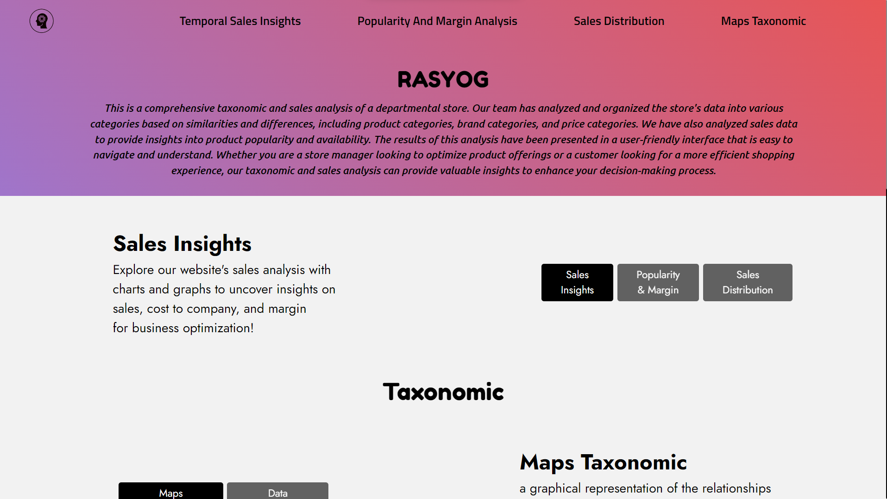

# Rasyog Website

## Table of Contents

- [Project Overview](#project-overview)
- [Installation](#installation)
- [Description of Components](#description-of-components)

## Project Overview

Rasyog is a powerful web application powered by Yoglabs specifically for Jaipur Modern Store. It offers a comprehensive taxonomic and sales analysis of this departmental store, providing valuable insights into its product inventory and sales trends.



## Features and Benefits

- **Taxonomic Analysis:** Rasyog organizes the store's data into various categories, such as product categories, brand categories, and price categories. This classification system allows for efficient data management and enables users to explore and navigate the store's offerings effortlessly.

- **Sales Analysis:** By analyzing the sales data, Rasyog provides valuable insights into product popularity and availability. Store managers can use this information to optimize their product offerings and make informed decisions about inventory management.

- **User-Friendly Interface:** Rasyog presents the results of the taxonomic and sales analysis in a user-friendly interface. The interface is designed to be intuitive and easy to navigate, ensuring that both store managers and customers can access and interpret the data effortlessly.

- **Enhanced Decision Making:** Whether you are a store manager looking to optimize product offerings or a customer seeking a more efficient shopping experience, Rasyog's taxonomic and sales analysis offers valuable insights to enhance your decision-making process. It helps you make informed choices based on the store's product inventory, sales trends, and customer preferences.

Rasyog is a powerful tool that empowers Jaipur Modern Store to make data-driven decisions and provide an enhanced shopping experience for its customers. With its comprehensive analysis and user-friendly interface, Rasyog is an invaluable asset for optimizing store operations and maximizing customer satisfaction.

## Installation

To install and set up the project locally, follow the instructions below:

1. Clone the repository:

```shell
git clone <repository_url>
```

2. Install required packages:

```shell
npm i
```

```shell
npm install
```

3. Start the server (Open http://localhost:3000 to view it in your browser) :

```shell
npm start
```

4. To build the app for production to the build folder.

```shell
npm run build
```

## Description of Components

- [src/pages](https://github.com/ashishsoniii/RasYog/tree/main/frontend/src/pages) - navbar | Content(All inside pages) | footer <br>
  --Footer.js - Footer component which contains copyright information <br>
  --Navbar.js - Navbar component that has navbar :) <br><br>
- [src/pages/content](https://github.com/ashishsoniii/RasYog/tree/main/frontend/src/pages/content) <br>
  --Components <br>
  --Button.js | Button_2.js - Displays 3 : 2 Button respectively <br>
  --userCard.js - Contains Card Component with Image & Text inside card <br>
  --Team.js - Team Page here <br>
  --Slider.js | SliderReverse.js - Slider Component to select year <br>
  --ReactSlider.js - Helper Function for card.js <br>
  --LiveSearch.js - Comonent to select graph from options (Axios API call)<br>
  --DialogGraph.js - Displays GRaph in Dialog box (Full Screen)<br>
  --graph.js - Important component to display graph! (Main Comonent | helper To dialogGrpah / sliders | Axios Call)<br>

<br><br>
--Home.js - Landing Page of Rasyog! <br>
--DataAnalysis.js - Containes all stuff related to display graph on page (/dataAnalysis) <br>
--Graph.js - Axios API call to backend to fetch data and display on frontend! <br>
--UploadFiles.js - Uploades analysis file from frontend to backend Home!!
--Content.css - CSS of all components are here

---
